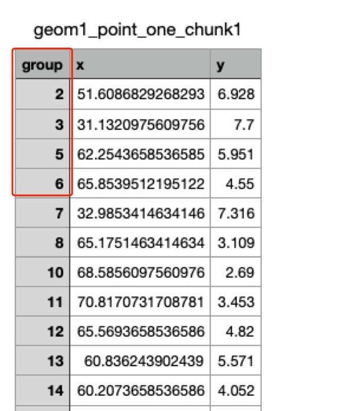
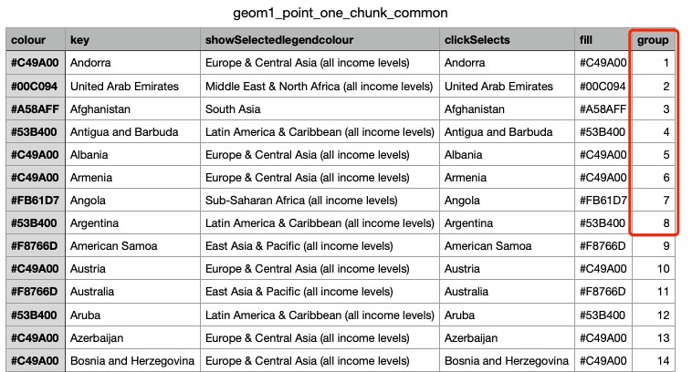

### Summary
Profiling with profvis shows that [```getCommonChunk```](https://github.com/tdhock/animint2/blob/96ec0caf446c555ae847febdf3681de6a6525ee8/R/z_animintHelpers.R#L750-#L874) function takes a lot of time inside compiler, so it is worth trying to rewrite the func which was based on ```data.frame```. View the profile [here](https://bl.ocks.org/Faye-yufan/f81c1a8f27050acc3bc11b169d515c19).

`data.table`  inherits from `data.frame` and works perfectly even when data.frame syntax is applied on data.table. And one of its most notable features is speed. So I tried to improve the speed by using data.table.

### Development Log
I started rewriting ```getCommonChunk``` func with ```data.table``` and tested it with @csaluski 's example above in the past few days. 

It seems to get some improvements until now. I only modified some parts of the function and the time cost has already reduced by around 15%. See the profile [here](https://bl.ocks.org/Faye-yufan/3f2129fbb9ea9961d9ce74b90158d60e), where ```animint2dir_dt()``` is the new func.

#### Logic inside `getCommonChunk` func
The `built` data.frame contains `aes()`, `showSelected` and `clickSelects` parameters which users passed into the ggplot geom objects and constructed by `ggplot_build()`. So animint would devide these into many data files to present the animation of data.  
Apparently, many parameters/columns is the same for each file, so in order to save disk usage, there is an `getCommonChunk()` function inside compiler to output a common chunk data file. Here is an example:
```
data(WorldBank)
years <- data.frame(year=unique(WorldBank$year))
add.x.var <- function(df, x.var){
  data.frame(df, x.var=factor(x.var, c("life expectancy", "year")))
}
scatterFacet <- ggplot()+
  geom_point(aes(
    x=life.expectancy, y=fertility.rate, color=region,
    key=country),
    showSelected="year",
    clickSelects="country",
    data=add.x.var(WorldBank, "life expectancy"))+
  geom_text(aes(
    x=life.expectancy, y=fertility.rate, label=country,
    key=country),
    clickSelects="country",
    showSelected=c("year", "country", "region"),
    data=add.x.var(WorldBank, "life expectancy"))+
  facet_grid(. ~ x.var, scales="free")+
  xlab("")+
  theme_bw()+
  theme(panel.margin=grid::unit(0, "lines"))

scatterTS <- scatterFacet+
  geom_tallrect(aes(
    xmin=year-0.5, xmax=year+0.5),
    clickSelects="year",
    alpha=0.5,
    data=add.x.var(years, "year"))+
  geom_line(aes(
    x=year, y=fertility.rate, group=country, color=region),
    clickSelects="country",
    size=3,
    alpha=0.6,
    data=add.x.var(WorldBank, "year"))

viz.facets <- list()
viz.facets$one <- scatterTS
animint2dir(viz.facets, "animint_out/worldBank", open.browser = TRUE)
```
And generate a bunch of files like below:  
  
  
Those contain data user selected each year. And we can see there is a column called `group`. Since inside this file, there is only coordinate, other information of the data contains in the `group` which saved in the `common_chunk` file.  
  
From the above we can see that each group has the attributes/parameters we defined in the geom object.

#### Breakthrough
After I struggled with `data.table` syntax and logic of the animint compiler for a while, I started getting some sense of how they are put together.

An _aha_ moment would be @tdhock 's inspiration on how to optimize code speed generally. The most important thing is to identify which part of the code is the slowest and fix it. 

> “Programmers waste enormous amounts of time thinking about, or worrying about, the speed of noncritical parts of their programs, and these attempts at efficiency actually have a strong negative impact when debugging and maintenance are considered.”
> — Donald Knuth.

Also, I think the debug tool in R is very useful when it comes to understand some functions or data structure. And this credit to @csaluski, he showed me how to utilize this powerful tool.


#### Errors and solutions
1. ```In `[.data.table`(built, , `:=`(which(sapply(built, function(col) all(is.na(col)))),  :
  length(LHS)==0; no columns to delete or assign RHS to.```
  built <- built[ , which(sapply(built, function(col) all(is.na(col)))) := NULL]
  
 2. ```Error in htmlwidgets::saveWidget(p, "profile-1.html") : 
  Saving a widget with selfcontained = TRUE requires pandoc. For details see:
https://github.com/rstudio/rmarkdown/blob/master/PANDOC.md```
Sys.setenv(RSTUDIO_PANDOC="/Applications/RStudio.app/Contents/MacOS/pandoc")

3. Reference of using `data.table` in R package, see [here](https://cran.r-project.org/web/packages/data.table/vignettes/datatable-importing.html).

4. testthat does not recognize data.table? [GH issue](https://github.com/Rdatatable/data.table/issues/2053) has discussed about the problem.

5. `setDT()` + `data.table` operations + `setDF()` can not return to the original `data.frame` when return from a function.  
* [Using setDF() within a function will not modify global object, while setDT() does?#4816](https://github.com/Rdatatable/data.table/issues/4816)
So better to substitute 'as.data.table' for 'setDT' to make a deep copy for the built data.frame, a deep copy currently cannot be avoided if deal with a data.frame passed as a function parameter


### Commits:
- The first/main PR on this issue, [#63 commits](https://github.com/tdhock/animint2/pull/63/commits)
- A bug was found thanks to @tdhock, and fixed it on another PR, [#75 commits](https://github.com/tdhock/animint2/pull/75/commits)

### Resources
#### `data.table` vignettes:
* [Introduction to data.table](https://cran.r-project.org/web/packages/data.table/vignettes/datatable-intro.html)